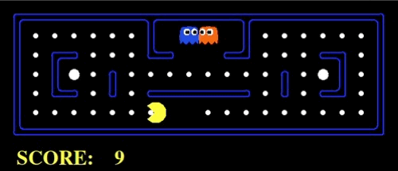

# Pacman Artificial Intelligence Project

Project for the Artificial Intelligence course. The objective is to tackle diverse challenges presented in the Pacman universe, such as finding the shortest path, consuming all dots, and evading enemies. These tasks have been addressed through the utilization of different search algorithms like depth-first search, A*, and minmax.

## Table Of Content

- [Course content](#course-content)
- [Grading](#grading)
- [Getting Started](#getting-started)
- [Contribution](#contribution)
- [See also](#see-also)

## Course content

The purpose of this project is to further explore and solidify the concepts learned in the Artificial Intelligence course.

The course will cover the basic ideas and techniques underlying the design of intelligent machines. By the end of this course, you will have learned how to build autonomous (software) agents that efficiently make decisions in fully informed, partially observable and adversarial settings as well as how to optimize actions in uncertain sequential decision making environments to maximize expected reward.

Syllabus:
- Informed search
- Uninformed search
- Adversarial search
- Constraint Satisfaction Problems
- Local search and Optimization
- Markov Decision Processes
- Reinforcement Learning

## Grading

| Assignment  | Grade |
| ------------- | ------------- |
| part1 q1  | 3/3  |
| part1 q2  | 3/3  |
| part1 q3  | 3/3  |
| part1 q4  | 3/3  |
| part1 q5  | 3/3  |
| part1 q6  | 3/3  |
| part1 q7  | 3/4  |
| part2 q2  | 5/5  |
| part2 q3  | 5/5  |
| part2 q4  | 5/5  |
| exam  | 1.3  |

## Getting Started 

### Dependencies
 * python 3
 * python3-tk

### Run
 * `git clone https://github.com/thob97/pacman-artificial-intelligence-project.git`
 * `cd pacman-artificial-intelligence-project/code_src`
 * `cd search` (for part1 q1-7)
 * `cd multiagent` (for part2 q2-4)
 * run all tests with python `pyhton3 autograde.py` or a specific test with `python3 autograder.py -q q<num>` (specific tests may display graphics)

## Contribution

* Thore Brehmer - solved project part 1 & part 2
* Jonny Lam - 

## See also
* [Uni Overview](https://github.com/thob97/uni_overview.git)
